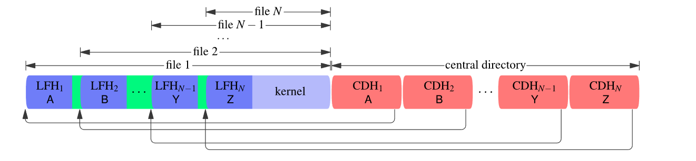
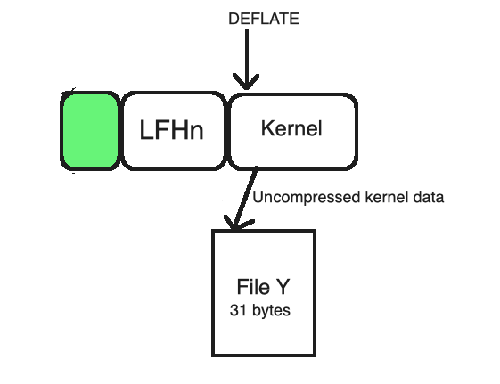
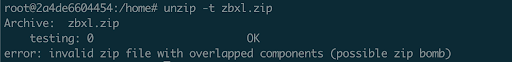

# Non-recursive-zip-bombs
Understanding how non recursive zip bombs are assembled and disassembled by the parsers

# Structure of a zip file

 

Central Directory Header (CDH) - (46 bytes + filename length) contains metadata for a single file, like its,

- File name
- CRC-32 checksum
- Backward pointer to the Local file header(LFH)
- ...
 

Local File Header (LFH) - (30 bytes + filename length) contains 

- Redundant copy of the metadata from the CDH
- Compressed and uncompressed size of file data
 

Note:

Zip => Container format

DEFLATE => Compression format (usually mentioned in the metadata)

 

## Attack insight 1: Overlapping files 

Kernel => Highly compressed data ( lot of 0s compressed eg: 10 0s = 10000000000)

 

Idea: Making many CDHs point to the same single file whose data is kernel.

This attack doesn’t work across all zip parsers because all of the CDHs point to a single LFH and the metadata it contains can only refer to one of the file names mentioned in the CDH, so there is a mis-match in the file names causing certain parsers to bail out while others continue to process.

Processed:

Bailed out:

# Attack insight 2: Quoting local file headers

Idea: To separate the local file headers for each file while still reusing a single kernel.

Although simply concatenating all the LFH would not work, because zip parsers will find a LFH where it expects to find the beginning of DEFLATE stream. [More details in the construction and analysis section]

The workaround to that is utilizing DEFLATE stream’s non-compressed feature (LFH section)

 

DEFLATE stream can contain:

- Compressed section = eg: kernel/data
- Non compressed section = 5 byte header (which says o/p next n bytes as it is) eg: 5 byte header would say print next 31 bytes as it is.
 

Compressed(kernel) and non-kernel(code) blocks may be intermixed freely in a DEFLATE stream, there’s no restriction to that.

 

# Construction
- We will start backwards with the construction
- Insert kernel(highly dense data) - this forms the end of file data for every file

- Prepend a LFHn and a CDHn representing file ‘Z’ which points to LFHn

- Set the compressed size of LFHn and CDHn to the compressed size of kernel
- Prepend a 5 byte non-compressed block header(in green) whose length field is equal to the size of LFHn

- Prepend a second LFHn-1 and add a CDHn-1 representing file ‘Y’ which points to LFHn-1.

- Set the compressed size metadata field in LFHn-1 and CDHn-1 to the compressed size of the kernel + size of non-compressed block + size of LFHn 
- Now zip file contains two files namely, “Y” and “Z”
 

 

 

# Parsing
Walking through the zip parser, let’s make the assumption that

Kernel = 1000 bytes compressed data

LFHn  = 31 bytes

 

- We start at CDHn-1 and follow the pointer to LFHn-1

- First filename is “Y” and its compressed size is 1036 bytes ( 1000 bytes kernel + 31 bytes LFHn + 5 byte non-compressed header)
- DEFLATE stream will first encounter the 5 byte header of non-compressed block which says print/copy the next 31 bytes as it is to file “Y”

- DEFLATE stream will next reach the compressed block of kernel, from which it will decompress its data to the file “Y”

- We have finished processing for file ‘Y’
- For file ‘Z’ the same steps would be repeated but in this case as soon as DEFLATE stream starts its process it would hit the compressed block of kernel and immediately write the uncompressed data to File ‘Z’
 

So with this attack there’s no-recursion but using the same kernel block but multiple LFH and CDH pointing to it, one could achieve a zip bomb with better compatibility across zip parsers.

# Detection:
unzip (package)[https://packages.debian.org/sid/amd64/unzip/download](6.0-25) in its testing phase can detect it if you use the -t flag. (Avg time of 2 min 10 seconds) for the zip bomb file created using the above mentioned technique

 

More in depth comparisons and analysis can be found in the article referenced below.

Ref: https://www.bamsoftware.com/hacks/zipbomb/
